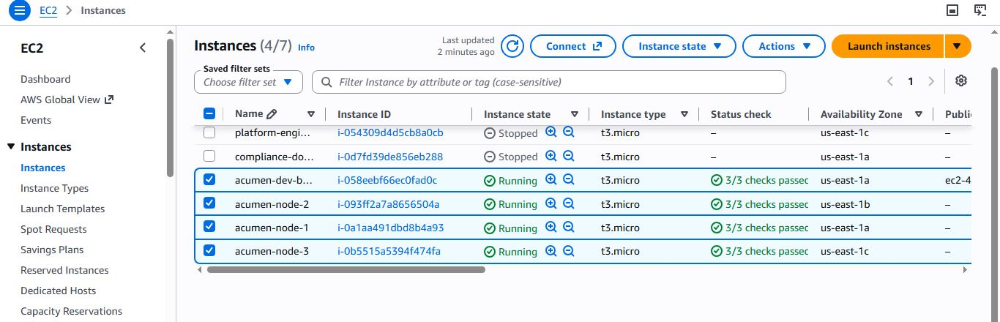
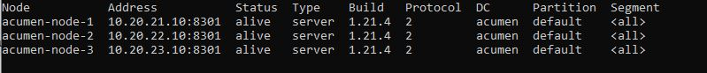
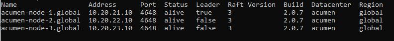
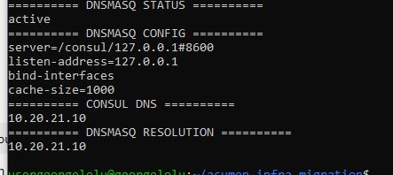
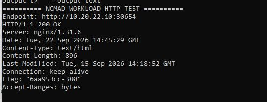
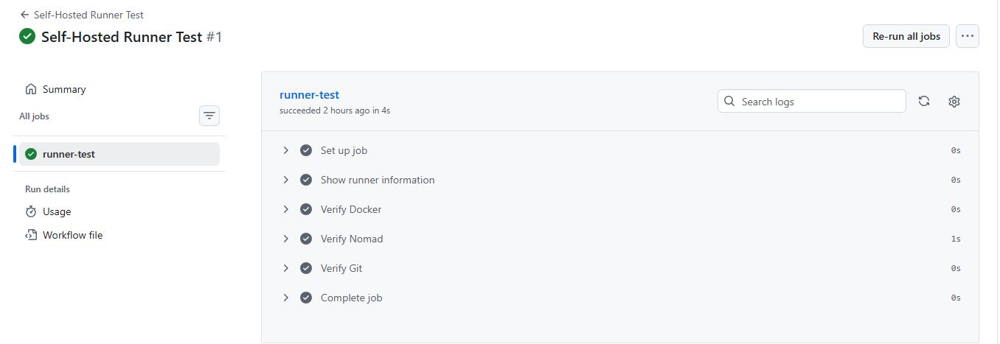

# Acumen Infrastructure Migration

[](https://github.com/georgelolu/acumen-infra-migration/actions/workflows/terraform.yml)
[](https://github.com/georgelolu/acumen-infra-migration/actions/workflows/runner-test.yml)

> **Highly available AWS platform infrastructure built with Terraform, Consul, Nomad, dnsmasq, AWS Systems Manager, and GitHub Actions.**

This project demonstrates the design, provisioning, configuration, and validation of a multi-AZ HashiStack platform on AWS.

The infrastructure is provisioned automatically with **Terraform** and validated through:

* Infrastructure and configuration validation
* Multi-node Consul cluster membership
* Nomad server leader election
* Nomad client readiness
* DNS-based service discovery
* Container workload scheduling
* HTTP application health testing
* GitHub Actions self-hosted runner execution


## Project Snapshot

| Area | Implementation |
|---|---|
| **Cloud** | AWS |
| **Infrastructure as Code** | Terraform |
| **Orchestration** | HashiCorp Nomad |
| **Service Discovery** | HashiCorp Consul + dnsmasq |
| **Automation** | GitHub Actions + self-hosted runner |
| **Remote Management** | AWS Systems Manager |
| **Architecture** | 3-node multi-AZ HA cluster |
| **Validation** | Cluster health, DNS, workload, HTTP 200, and CI |

### Key Evidence

- 📸 [Visual Evidence](#visual-evidence)
- ✅ [Validation Results](#validation-results)
- 🤖 [Self-Hosted GitHub Actions Runner](#github-actions-self-hosted-runner)
- 🏗️ [Terraform Structure](#terraform-structure)
- 📄 [Evidence Files](#evidence-files)

---

## Project Overview

The goal of this project was to build a platform infrastructure environment demonstrating practical **Cloud, DevOps, Infrastructure as Code, platform engineering, automation, and operational troubleshooting** skills.

The environment includes:

* AWS VPC with public and private subnets
* Multi-AZ infrastructure across three Availability Zones
* Bastion host for controlled administration
* AWS Systems Manager for remote management
* Three-node Consul cluster
* Three-node Nomad server/client cluster
* dnsmasq forwarding to Consul DNS
* Docker-based Nomad workloads
* GitHub Actions self-hosted runner
* Terraform-based infrastructure provisioning
* Automated Terraform CI validation

### What I Implemented

| Area                   | Implementation                                           |
| ---------------------- | -------------------------------------------------------- |
| Infrastructure as Code | Terraform                                                |
| Cloud Platform         | AWS                                                      |
| Networking             | VPC, subnets, route tables, NAT Gateway, security groups |
| High Availability      | 3-node multi-AZ cluster                                  |
| Service Discovery      | Consul + Consul DNS                                      |
| DNS Forwarding         | dnsmasq                                                  |
| Workload Orchestration | Nomad                                                    |
| Containers             | Docker                                                   |
| Remote Operations      | AWS Systems Manager                                      |
| CI/CD                  | GitHub Actions                                           |
| Self-Hosted CI         | GitHub Actions runner on Nomad node                      |
| Validation             | Cluster, DNS, workload, HTTP, and CI tests               |

---

## DevOps Skills Demonstrated

This project provides practical evidence of:

* **Terraform / Infrastructure as Code**
* **AWS infrastructure provisioning**
* **Linux system administration**
* **VPC and network architecture**
* **Security groups and IAM**
* **High-availability architecture**
* **Consul service discovery**
* **Nomad workload orchestration**
* **Docker container execution**
* **DNS troubleshooting**
* **AWS Systems Manager operations**
* **GitHub Actions CI/CD**
* **Self-hosted GitHub Actions runners**
* **Infrastructure validation and troubleshooting**
* **Technical documentation and operational evidence**

---

## Architecture

```text
                              AWS
                               │
                    ┌──────────▼──────────┐
                    │        VPC           │
                    │     10.20.0.0/16     │
                    └──────────┬───────────┘
                               │
              ┌────────────────┴────────────────┐
              │                                 │
        Public Subnet                     Private Subnets
              │                                 │
        ┌─────▼─────┐               ┌───────────┼───────────┐
        │  Bastion  │               │           │           │
        │ 10.20.1.x │               ▼           ▼           ▼
        └───────────┘           Node 1       Node 2       Node 3
                                10.20.21.10  10.20.22.10  10.20.23.10
                                    │            │            │
                                    ├────────────┼────────────┤
                                    │            │            │
                                  Consul       Consul       Consul
                                  Nomad        Nomad        Nomad
                                    │            │            │
                                    └────────────┼────────────┘
                                                 │
                                          Nomad Scheduler
                                                 │
                                                 ▼
                                           Application
                                            Workloads
```

### Core Components

| Component             | Purpose                                    |
| --------------------- | ------------------------------------------ |
| AWS VPC               | Isolated network environment               |
| Public subnet         | Bastion and NAT connectivity               |
| Private subnets       | HashiStack cluster nodes                   |
| NAT Gateway           | Outbound internet access for private nodes |
| Bastion               | Administrative access point                |
| AWS SSM               | Secure remote administration               |
| Consul                | Service discovery and cluster membership   |
| Nomad                 | Workload scheduling and orchestration      |
| dnsmasq               | Local DNS forwarding to Consul             |
| GitHub Actions Runner | Self-hosted CI/CD execution                |

---

## High-Availability Design

The three cluster nodes are distributed across separate Availability Zones:

```text
us-east-1a → acumen-node-1 → 10.20.21.10
us-east-1b → acumen-node-2 → 10.20.22.10
us-east-1c → acumen-node-3 → 10.20.23.10
```

This provides multi-AZ placement for the Consul and Nomad control planes.

The design uses three cluster nodes so that control-plane services can maintain quorum while workloads can be scheduled across multiple clients.

---

## Infrastructure

The environment is provisioned using **Terraform**.

### AWS Resources

The infrastructure includes:

* VPC
* Internet Gateway
* Public and private subnets
* Route tables
* NAT Gateway
* Elastic IP
* Bastion host
* Three private cluster nodes
* Security groups
* IAM roles and instance profiles
* AWS Systems Manager integration
* GitHub Actions self-hosted runner registration

### Terraform Structure

```text
terraform/
├── provider.tf
├── versions.tf
├── variables.tf
├── main.tf
├── vpc.tf
├── security.tf
├── iam.tf
├── bastion.tf
├── consul-nomad.tf
├── runner.tf
├── outputs.tf
├── templates/
│   ├── bastion.sh
│   ├── cluster.sh
│   └── runner.sh
├── terraform.tfvars.example
└── .terraform.lock.hcl
```

Sensitive Terraform files such as state files, plans, and the local `terraform.tfvars` are excluded through `.gitignore`.

---

## Consul

Consul provides service discovery and cluster membership.

### Verified Cluster

```text
acumen-node-1    10.20.21.10:8301    alive    server
acumen-node-2    10.20.22.10:8301    alive    server
acumen-node-3    10.20.23.10:8301    alive    server
```

Version:

```text
Consul 1.21.4
```

All three servers were confirmed alive in the `acumen` datacenter.

---

## Nomad

Nomad provides workload scheduling and orchestration.

### Verified Servers

```text
acumen-node-1.global    10.20.21.10    alive    leader
acumen-node-2.global    10.20.22.10    alive
acumen-node-3.global    10.20.23.10    alive
```

Nomad version:

```text
2.0.7
```

Raft version:

```text
3
```

One server was confirmed as the Raft leader while all three servers remained alive.

### Verified Clients

```text
acumen-node-1    ready    eligible
acumen-node-2    ready    eligible
acumen-node-3    ready    eligible
```

All three Nomad clients were confirmed ready and eligible for workload scheduling.

---

## DNS and Service Discovery

The platform uses **dnsmasq** as the local DNS forwarding layer in front of Consul DNS.

```text
Application / Host
        │
        ▼
dnsmasq :53
        │
        ▼
Consul DNS :8600
        │
        ▼
*.node.consul
        │
        ▼
Cluster node IP
```

### Verified Configuration

```text
server=/consul/127.0.0.1#8600
listen-address=127.0.0.1
bind-interfaces
cache-size=1000
```

### Verified Resolution

```text
acumen-node-1.node.consul
        ↓
10.20.21.10
```

Both direct Consul DNS resolution and dnsmasq-forwarded resolution were tested successfully.

---

## Workload Validation

A temporary Nginx workload was deployed through Nomad to validate the complete scheduling and networking path.

### Deployment

```text
Job:              acumen-test
Task:             nginx
Container:        nginx
Status:            running
Deployment:        healthy
```

The workload was scheduled onto a Nomad client and exposed through the allocated port.

### HTTP Validation

```text
Endpoint: http://10.20.22.10:30654

HTTP/1.1 200 OK
Server: nginx/1.31.6
Content-Type: text/html
```

This demonstrated that the platform could:

1. Accept a Nomad workload.
2. Schedule the workload to a cluster client.
3. Start the Docker container.
4. Expose the workload through the allocated network port.
5. Successfully return an HTTP response.

---

## GitHub Actions Self-Hosted Runner

A self-hosted GitHub Actions runner was deployed on the Acumen cluster.

Runner:

```text
acumen-node-1-runner
```

The runner was registered against:

```text
georgelolu/acumen-infra-migration
```

### Runner Validation

The workflow verified:

* Runner identity
* Linux operating system
* CPU architecture
* Hostname
* Docker
* Nomad
* Git

The **Self-Hosted Runner Test** completed successfully, demonstrating that GitHub Actions jobs can execute on the infrastructure provisioned by this project.

---

## CI/CD

The repository uses GitHub Actions for infrastructure validation.

### Terraform CI

The Terraform workflow performs:

```text
Checkout
   │
   ▼
Setup Terraform
   │
   ▼
terraform fmt -check
   │
   ▼
terraform init -backend=false
   │
   ▼
terraform validate
```

The current Terraform CI workflow is passing.

### Self-Hosted Runner Test

A separate workflow verifies that GitHub Actions can execute directly on the self-hosted Acumen runner.

The workflow validates:

```text
GitHub Actions
      │
      ▼
Self-Hosted Runner
      │
      ├── Linux
      ├── Docker
      ├── Nomad
      └── Git
```

---

## Validation Results

The deployed platform was validated end-to-end rather than only checking Terraform syntax.

| Validation            | Result                                      | Evidence                                          |
| --------------------- | ------------------------------------------- | ------------------------------------------------- |
| Consul cluster        | **3/3 servers alive**                       | `docs/evidence/01-cluster-health.txt`             |
| Nomad servers         | **3/3 servers alive**                       | `docs/evidence/01-cluster-health.txt`             |
| Nomad clients         | **3/3 ready and eligible**                  | `docs/evidence/01-cluster-health.txt`             |
| Consul DNS            | **Resolves to 10.20.21.10**                 | `docs/evidence/02-dns-service-discovery.txt`      |
| dnsmasq               | **Active and forwarding `.consul` queries** | `docs/evidence/02-dns-service-discovery.txt`      |
| Nomad workload        | **Deployment healthy**                      | `docs/evidence/05-nomad-workload-http-200.png`    |
| HTTP application test | **HTTP 200 OK**                             | `docs/evidence/05-nomad-workload-http-200.png`    |
| GitHub Actions runner | **Self-hosted runner test successful**      | `docs/evidence/06-self-hosted-runner-success.png` |
| Terraform validation  | **Passed**                                  | GitHub Actions `Terraform CI`                     |

### Verified Platform State

```text
Consul
  3/3 servers alive
  Datacenter: acumen
  Version: 1.21.4

Nomad
  3/3 servers alive
  1 leader
  3/3 clients ready
  Version: 2.0.7

Service Discovery
  dnsmasq :53
      ↓
  Consul DNS :8600
      ↓
  acumen-node-1.node.consul
      ↓
  10.20.21.10

Workload
  Nomad deployment: healthy
  nginx container: running
  HTTP response: 200 OK

CI/CD
  GitHub Actions self-hosted runner: successful
```

---

## Visual Evidence

The following screenshots provide visual evidence of the deployed infrastructure, platform health, service discovery, workload execution, and CI/CD automation.

### 1. AWS Infrastructure

AWS resources provisioned for the Acumen environment, including the VPC, subnets, EC2 instances, and supporting infrastructure.



### 2. Consul High Availability

Three Consul server nodes confirmed alive across multiple Availability Zones.



### 3. Nomad High Availability

Three Nomad servers confirmed alive with an elected leader and ready clients.



### 4. DNS Service Discovery

dnsmasq forwarding DNS queries to Consul and resolving the cluster node through the `.consul` domain.



### 5. Nomad Workload — HTTP 200

A containerized Nginx workload scheduled by Nomad and successfully responding with HTTP 200.



### 6. Self-Hosted GitHub Actions Runner

GitHub Actions successfully executing a workflow on the self-hosted runner deployed on the Acumen cluster.



---

## AWS Systems Manager

AWS Systems Manager provides remote administration of the infrastructure without requiring routine direct SSH access to the private cluster nodes.

Verified managed instances included:

```text
Bastion
acumen-node-1
acumen-node-2
acumen-node-3
```

The cluster was administered and validated using SSM Run Command, including:

* Consul cluster checks
* Nomad server checks
* Nomad client checks
* DNS validation
* dnsmasq status checks
* Workload validation
* System service inspection

---

## Security

Security considerations implemented in the infrastructure include:

* Cluster nodes deployed in private subnets
* Bastion host separated into the public subnet
* Security groups controlling cluster communication
* Restricted administrative access
* AWS IAM roles and instance profiles
* AWS Systems Manager for remote management
* No Terraform state committed to Git
* No local Terraform variables containing secrets committed to Git
* GitHub runner credentials supplied as sensitive Terraform variables
* `.gitignore` configured to exclude state, plans, credentials, and local configuration

---

## Repository Structure

```text
acumen-infra-migration/
├── .github/
│   └── workflows/
│       ├── terraform.yml
│       └── runner-test.yml
│
├── docs/
│   └── evidence/
│       ├── 01-cluster-health.txt
│       ├── 01-aws-infrastructure.png
│       ├── 02-dns-service-discovery.txt
│       ├── 02-consul-ha.png
│       ├── 03-nomad-ha.png
│       ├── 04-dns-service-discovery.png
│       ├── 05-nomad-workload-http-200.png
│       └── 06-self-hosted-runner-success.png
│
├── terraform/
│   ├── provider.tf
│   ├── versions.tf
│   ├── variables.tf
│   ├── main.tf
│   ├── vpc.tf
│   ├── security.tf
│   ├── iam.tf
│   ├── bastion.tf
│   ├── consul-nomad.tf
│   ├── runner.tf
│   ├── outputs.tf
│   └── templates/
│
├── .gitignore
└── README.md
```

---

## Terraform Workflow

The infrastructure can be managed using the standard Terraform workflow:

```bash
terraform -chdir=terraform init
terraform -chdir=terraform fmt -recursive
terraform -chdir=terraform validate
terraform -chdir=terraform plan
terraform -chdir=terraform apply
```

For CI validation, the repository uses:

```bash
terraform fmt -check -recursive
terraform init -backend=false
terraform validate
```

---

## Technologies

| Category          | Technologies                                |
| ----------------- | ------------------------------------------- |
| Cloud             | AWS                                         |
| IaC               | Terraform                                   |
| Operating System  | Ubuntu Linux                                |
| Orchestration     | HashiCorp Nomad                             |
| Service Discovery | HashiCorp Consul                            |
| Containers        | Docker                                      |
| DNS               | dnsmasq, Consul DNS                         |
| CI/CD             | GitHub Actions                              |
| Remote Management | AWS Systems Manager                         |
| Networking        | AWS VPC, subnets, route tables, NAT Gateway |
| Security          | AWS IAM, Security Groups                    |
| Automation        | Terraform, Bash, GitHub Actions             |

---

## Project Outcomes

This project demonstrates a complete infrastructure lifecycle:

```text
Infrastructure Design
        │
        ▼
Terraform Provisioning
        │
        ▼
AWS Network + Compute
        │
        ▼
Consul + Nomad Configuration
        │
        ▼
DNS / Service Discovery
        │
        ▼
Container Workload
        │
        ▼
Application HTTP Validation
        │
        ▼
GitHub Actions Self-Hosted Runner
        │
        ▼
Automated Terraform Validation
        │
        ▼
Operational Evidence
```

The result is a documented, Terraform-managed AWS platform with multi-AZ HashiStack services, service discovery, workload scheduling, remote operations, CI/CD integration, and verification evidence.

---

## Evidence Files

Detailed command output from the validation process is stored in:

```text
docs/evidence/01-cluster-health.txt
docs/evidence/02-dns-service-discovery.txt
```

Visual validation evidence is stored in:

```text
docs/evidence/01-aws-infrastructure.png
docs/evidence/02-consul-ha.png
docs/evidence/03-nomad-ha.png
docs/evidence/04-dns-service-discovery.png
docs/evidence/05-nomad-workload-http-200.png
docs/evidence/06-self-hosted-runner-success.png
```

These files provide reproducible evidence of the infrastructure and platform validation performed during the project.

---

## Project Status

**Infrastructure:** Validated

**Terraform CI:** Passing

**Consul HA:** 3/3 servers alive

**Nomad HA:** 3/3 servers alive

**Nomad Clients:** 3/3 ready

**DNS Service Discovery:** Verified

**Nomad Workload:** Validated with HTTP 200

**Self-Hosted GitHub Runner:** Validated

**Documentation:** Complete

---

## Author

**George Omololu Akinbi**

Cloud & DevOps Engineer

GitHub: [github.com/georgelolu](https://github.com/georgelolu)

---

## License

This project is intended as a portfolio and learning project demonstrating practical Cloud and DevOps engineering techniques.

